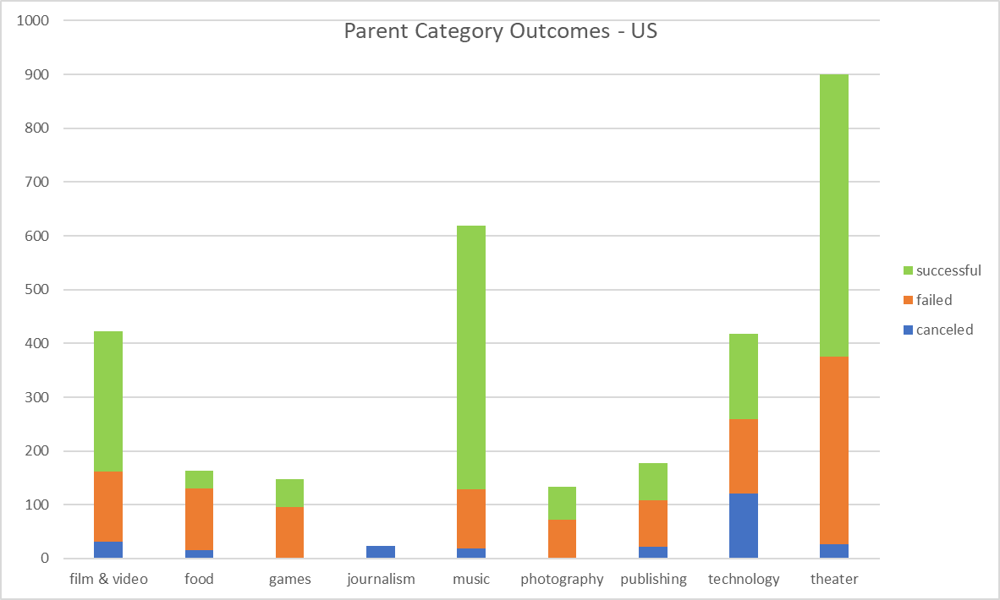

# Kickstarting with Excel

## Overview of Project
Up-and-coming playwright Louise Belcher intends to launch a Kickstarter to fund her play in the United States, *Fever*. She estimates a budget of over $10,000. 

### Purpose
The purpose of this project is to analyze other crowdfunding data, specifically within the United States and the theater industry. This analysis will determine factors that make for a successful crowdfunding campaign and help Louise Kickstart her own project successfully. 

## Analysis and Challenges
To begin the analysis, I gathered data from over 4,000 Kickstarter projects. The projects ranged in categories, locations, goals, launch dates, and outcomes. The data was represented in a variety of forms, including text, numerical, and unconverted UNIX dates. 

First, I needed to create some additional columns for subcategory of projects so we could compare Louise's goal of crowdfunding a play to other examples of play crowdfunding. It was important to convert the UNIX dates into a more recognizable format in order to analyze the impact of launch dates. There is a worksheet that computes the central tendancy and spread based on successful and failed projects, which informed the final analysis of outcomes based on goals.  

The data analysis provided useful information that can aid Louise in achieving her goals. Based on parent category outcomes, Kickstarters in support of theater are very popular, far exceeding other kinds of Kickstarters. 

### Analysis of Outcomes Based on Launch Date

### Analysis of Outcomes Based on Goals

### Challenges and Difficulties Encountered

## Results

- What are two conclusions you can draw about the Outcomes based on Launch Date?

- What can you conclude about the Outcomes based on Goals?

- What are some limitations of this dataset?

- What are some other possible tables and/or graphs that we could create?
